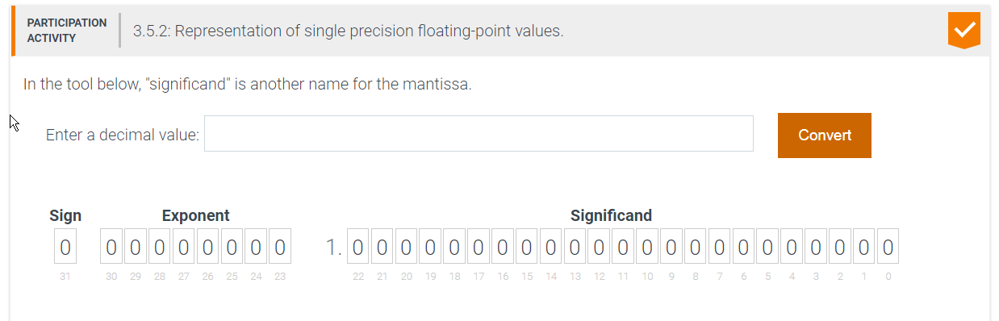
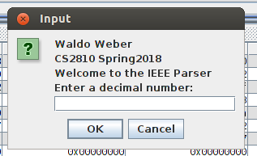
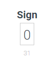
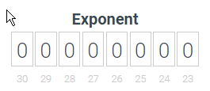
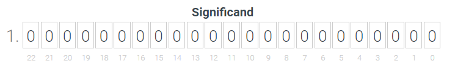
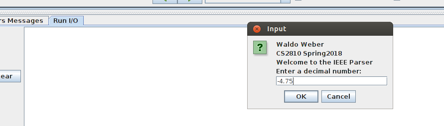
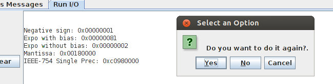
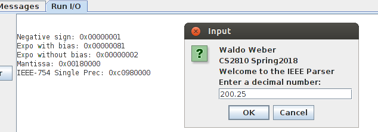
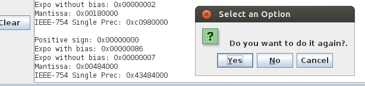
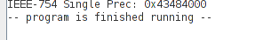

# 1. Module 4 Challenge Activity: MIPS Procedures

- [1. Module 4 Challenge Activity: MIPS Procedures](#1-module-4-challenge-activity-mips-procedures)
  - [1.1. Purpose](#11-purpose)
  - [1.2. Skills and Knowledge](#12-skills-and-knowledge)
  - [1.3. Overview](#13-overview)
  - [1.4. Task 1: Main Procedure](#14-task-1-main-procedure)
    - [1.4.1. Sample Output Task 1](#141-sample-output-task-1)
  - [1.5. Task 2: Take User Input Procedure](#15-task-2-take-user-input-procedure)
  - [1.6. Task 3: Print the sign](#16-task-3-print-the-sign)
  - [1.7. Task 4: Print the exponent](#17-task-4-print-the-exponent)
  - [1.8. Task 4: Print the significand](#18-task-4-print-the-significand)
  - [1.9. Task 6: Print value store from Task 2](#19-task-6-print-value-store-from-task-2)
    - [1.9.1. Sample Output](#191-sample-output)
      - [1.9.1.1. If your answer is YES](#1911-if-your-answer-is-yes)
      - [1.9.1.2. If your answer is NO](#1912-if-your-answer-is-no)
  - [1.10. Submission Checklist](#110-submission-checklist)

## 1.1. Purpose

This assignment we will review the IEEE-754 Single Floating point conversion. We will learn how to take floating point input from the user using a GUI and how to parse the three elements of the IEEE notation.

## 1.2. Skills and Knowledge

By the end of this assignment, you should feel comfortable:

1. Moving floating point values to and from floating point registers
2. Doing logical operation on registers
3. Use of MIPS Procedures
4. Working with multiple files
5. Interpreting the IEEE 754 representation of floating point numbers

## 1.3. Overview

For this assignment you will be writing a program the asks the user to
enter a decimal number and stores it in `IEEE 754 single-precision` floating point
representation.  You will then parse the IEEE 754 representation to extract the
different pieces (`sign, exponent, and significand`).  



You do not have to convert the input to IEEE 754 representation manually.  Just use
the `syscall` to read a float.  This will automatically store the value in IEEE 754
format for you.  You can then copy the value to a normal 32-bit register to perform
the different bit manipulations to extract each piece.  

After the initial reading in of the floating point value and moving the value to a
standard register you **should not** use the floating point registers again.  Do not
use any of the floating point operations to find the sign, or anything else.

All of the parsing and calculations should be done using various bit manipulations
operations (i.e. bitshifts, maskings, etc).  Remember beyond the initial reading of
the floating point value and moving it to a standard register your program should
not touch the floating point registers again.

Your program does not need to handle any of the special cases of floating point
numbers like NaN, infinity, -infinity, 0 or -0.

## 1.4. Task 1: Main Procedure

`void main()`

Your first task is to collect is to create a loop for your program.
Ask user to enter "Do you want to do it again?" in a Dialog box. Hint: Use `syscall 50`. If the user answers “YES” repeat the process. NO or Cancel, exit the program.

Begin working in the file template (`ca.asm`) provided in the `ca` folder.

```mips
# Author:
# Date:
# Description:

.globl parse_sign, parse_exponent, parse_significand, calc_truncated_uint, main   # Do not remove this line

# Data for the program goes here
.data

prompt: .asciiz "Enter an IEEE 754 floating point number in decimal form: "


.text     # Code goes here
main:

 # Task 2: setup and call read_float()

 # Task 3: setup and call print_sign()

 # Task 4: setup and call print_exponent()

 # Task 5: setup and call print_significand()

 # Task 6: Print capture float number in hex notation

 # Task 1: Ask User if they want to do it again: DO THIS FIRST

exit_main:
 li    $v0, 10  # 10 is the exit program syscall
 syscall   # execute call

## end of ca.asm
```

### 1.4.1. Sample Output Task 1


## 1.5. Task 2: Take User Input Procedure

`void read_float()`

Next, take user input and store it in memory. Prompt
the user to enter a floating point value as a decimal number. Then, store the input
value in a single precision floating point register.
In a `DialogBox` (syscall `52`), Display a string with info about the program ex: "Welcome to the …" and capture a user input. The input should be a floating point number.



You MUST `store` input into memory space (`ieee`). To do this, first move your captured input from the `f0` floating point register to a regular temporary register using the following call:

```mips
 mfc1  $t0, $f0  # copy register $f0 to $t0
```

Now, you should be able to `store` the value into the `ieee` variable in memory.

The procedure should have the following signature:

```mips
################################################################
# Procedure void read_float()
# Functional Description: Reads input from user using a pop up 
#  gui. It stores the capture value in ieee memory space
# Argument parameters: None
# Return Value: None
################################################################
# Register Usage:
read_float:
 # ....
read_float_ret:
 jr $ra
```

## 1.6. Task 3: Print the sign

`void print_sign(ieee)`

Your next task is to create a procedure called `print_sign` that will extract and
interpret the sign bit of the IEEE 754 single precision floating point number. The
floating point number is the value you collected from `Task 2`.



Your function will take the value as a 32-bit number in a non-floating
point register (i.e. `$a0`).  Remember, this value is stored in your `ieee` memory space. You should use bit manipulations (i.e. shifting,
masking, etc) to determine the value of the sign bit.  If the sign bit is a 1 your
function should print the `'-'` character.  If it is a 0 your function should print
the `'+'` character.

The procedure should have the following signature:

```mips
################################################################
# Procedure void print_sign(ieee)
# Functional Description: Extracts the sign bit from the input param
#  and prints it to the screen with a corresponding message
# Argument parameters: 
#  $a0: ieee single precession value
# Return Value: None
# 
# Note: sign character: 0x2B = '+', 0x2D = '-'
################################################################
# Register Usage:
print_sign:
 
 # The sing bit is the most significand bit. To isolate this bit you can use and AND to clear the other bits, then shift left 30 bits.
 
 # print_str(res_sign)
 
 # print char(- or +)

end_print_sign:
 jr    $ra
```

Remember, the sign bit in an IEEE 754 floating point number is the most significant bit.

## 1.7. Task 4: Print the exponent

`void parse_exp(ieee)`

Your next task is to create a procedure called `parse_exp` that will extract
and interpret the exponent bits of the IEEE 754 single precision floating point
number.
Your function will take the value as a 32-bit number in a non-floating point
register (i.e. `$a0`).  Next it will need to isolate the bits representing the
exponent and interpret those bits as an unsigned integer.  Finally, you will need
to subtract the bias to recover the true exponent value as a signed integer. This
is the value that should be returned.



The procedure should have the following signature:

```mips
################################################################
# Procedure void print_exp(ieee)
# Functional Description: Extracts the exponent bits from the input param
#  and prints it to the screen with a corresponding message
# Argument parameters: 
#  $a0: ieee single precession value
# Return Value: None
################################################################
# Register Usage:
print_exp:
 
 # clear all but bits 30-23
 
 # shift right 23 
 
 # subtract bias (hex)
 
 # print_str(expoBias)
 
 # print exponent with bias (hex)
 
 # print_str(expoNoBias)
 # print exponent with bias (hex)
 
end_print_exp:
 jr    $ra
```

Remember the exponent is the 8 bits immediately following the sign bit.

## 1.8. Task 5: Print the significand

`void print_significand(ieee)`

Your next task is to create a procedure called `print_significand` that will
extract the mantissa of the IEEE 754 single precision floating point number.
Your function will take the value as a 32-bit number in a non-floating point
register (i.e. `$a0`).  Next it will need to isolate the bits representing the
mantissa.  



The procedure should have the following signature:

```mips
################################################################
# Procedure void print_significand(ieee)
# Functional Description: Extracts the significand bits from the input param
#  and prints it to the screen with a corresponding message
# Argument parameters: 
#  $a0: ieee single precession value
# Return Value: None
################################################################
# Register Usage:
print_significand:
 
 # clear all but bits 30-23
 
 # print_str(manti)
 # print exponent with bias (hex)
 
end_print_significand:
 jr    $ra
```

Remember the mantissa is the low order 23 bits and you will need to add the implied 1.

## 1.9. Task 6: Print value store from Task 2

Finally, print the output you captured in Task 2 in IEEE 32 bit form

### 1.9.1. Sample Output




#### 1.9.1.1. If your answer is YES

Continue running the program



#### 1.9.1.2. If your answer is NO

Exit the program



## 1.10. Submission Checklist

- [x] Save and `commit` my code in github desktop
- [x] `Push` the code to github.com
- [x] Uploaded video of code walk-through in `Canvas`
- [x] Add your github repo as a comment to your assignment in `Canvas`.
